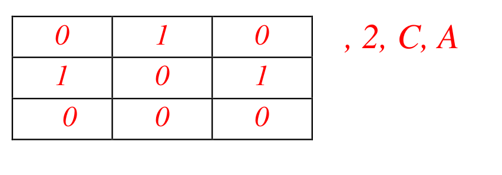

# Question
Write a program that involves a client and a server. The client sends server 4 values, for example X, n, B, C where, X is the adjacency matrix of a directed graph with 5 nodes A B C D E, and n is the length of the path from node B to node C. The server responds back with two responses:
- positive Y response (or negative N response) if there exists (or doesn't exist) a path of length n from B to C.
- the image of the directed graph with nodes A B C D E proving the validity of the
response.
For simplicity, assume a 5-node graph with nodes named A, B, C, D, E. 
For example: Let’s take a 3-node directed graph: 
### Case 1
**Input**: 

where, there is an adjacency matrix, 2 is the length of the path from node A to node C – that
server has to check whether it exists or not.
Server should return the following:
- **Output 1**: Yes, there exists a path of length 2 from node A to node C.
- **Output 2**: Graph: 

### Case 2
**Input:** 

where, there is an adjacency matrix, 2 is the length of the path from node C to node A.
Server should return the following: 
- **Output 1**: No, there is no path of length 2 from node C to node A.
- **Output 2**: Graph: 

